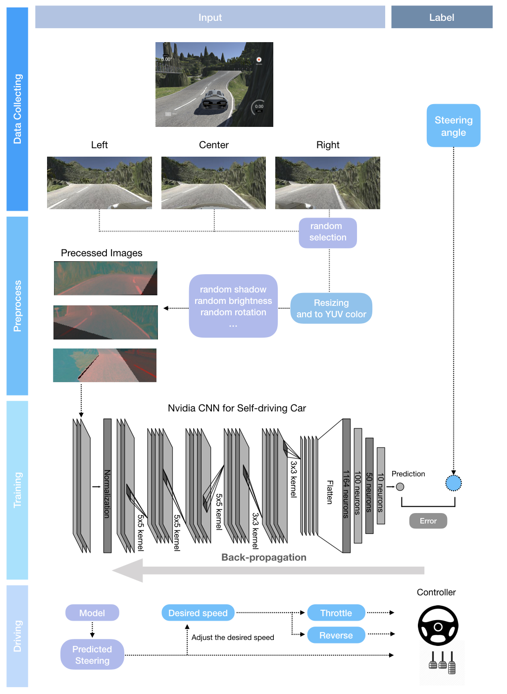

# Similated Self Driving Car

## Description

This project is building a self-driving program to drive a car on the Unity simulater ([link](https://github.com/blog/1395-relative-links-in-markup-files)).
The project used Nvidia self-driving car CNN architecture ([paper](https://images.nvidia.com/content/tegra/automotive/images/2016/solutions/pdf/end-to-end-dl-using-px.pdf))
and implemented with Tensorflow/Keras. <br /><br />
#### Check out the video demo [here](https://www.youtube.com/watch?v=O75wfU4zAiU).


### Prerequisites

Build a virtual enviroment in order to run the project: <br />
```python
## Use TensorFlow without GPU
conda env create -f environment.yml 

## Use TensorFlow with GPU
conda env create -f environment-gpu.yml
```
<br />

### Workflow Diagram

